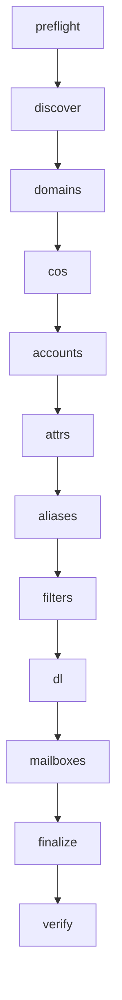

# Zimbra Full Tenant Migration

[English](README.md) · [Türkçe](README.tr.md)

`zimbra_full_migrate.sh` is a resumable **Zimbra-to-Zimbra** tenant/mailbox orchestrator.

It runs on the **new / destination** Zimbra server as the `zimbra` user. The source server is read over **passwordless SSH**. Mailbox data is streamed as TGZ over the Zimbra REST API; the source host is not asked to write a large temporary mailbox archive to disk.

This is a **logical tenant migration**, not a host clone.

> **Use at your own risk — all operational responsibility belongs to the operator.** This tool changes live Zimbra objects and mailbox data. The person or organization running it is solely responsible for backups, test migrations, change approval, downtime, capacity, security, legal/regulatory compliance, rollback, and validation of every migrated item. The software is provided without warranty; to the maximum extent permitted by applicable law, the author and contributors are not liable for data loss, corruption, outage, misdelivery, security incidents, or any direct or indirect damage. See the AGPL warranty and liability terms in [LICENSE](LICENSE).

```text
OLD Zimbra (source)                         NEW Zimbra (destination)
┌─────────────────────────┐                 ┌──────────────────────────────┐
│ zmprov / zmmailbox      │  SSH + zmprov   │ zimbra_full_migrate.sh       │
│ LDAP objects            │ ──────────────► │ 1. discover / provision      │
│ mailboxes (store)       │  SSH + REST TGZ │ 2. import via zmmailbox      │
└─────────────────────────┘                 │ 3. checkpoints + reports     │
                                            └──────────────────────────────┘
```

---

## Table of contents

1. [What this tool does](#what-this-tool-does)
2. [What this tool does not copy](#what-this-tool-does-not-copy)
3. [When to use it](#when-to-use-it)
4. [Requirements](#requirements)
5. [Quick start](#quick-start)
6. [Cutover runbook](#cutover-runbook)
7. [Command-line reference](#command-line-reference)
8. [Configuration](#configuration)
9. [Migration phases](#migration-phases)
10. [Checkpoint and resume model](#checkpoint-and-resume-model)
11. [Working directory layout](#working-directory-layout)
12. [Mailbox transfer details](#mailbox-transfer-details)
13. [Attribute and object policy](#attribute-and-object-policy)
14. [Safety and security](#safety-and-security)
15. [Verification and reports](#verification-and-reports)
16. [Operations and troubleshooting](#operations-and-troubleshooting)
17. [Limitations](#limitations)
18. [Developer](#developer)
19. [License](#license)
20. [Operational ownership](#operational-ownership)

---

## What this tool does

The script discovers objects on the source and recreates portable equivalents on the destination:

| Area | What is migrated |
| --- | --- |
| Domains | Local domains, then alias domains (after the target domain exists) |
| Domain settings | A small portable subset (`zimbraAuthMech`, GAL, public service host, logo URLs, mail status, and similar) |
| COS | COS names plus portable `zimbra*` COS attributes |
| Accounts | User accounts with display name / given name / surname |
| Passwords | Existing `userPassword` hashes (users keep the same password) |
| COS assignment | Source COS ID is mapped back to a COS name on the destination |
| Account prefs | Selected `zimbraPref*`, `zimbraFeature*`, quota, forwarding, and directory fields |
| Aliases | Account aliases (`zimbraMailAlias`) |
| Filters | Sieve scripts (`zimbraMailSieveScript`) |
| Distribution lists | Lists, portable DL attributes, DL aliases, and members |
| Mailboxes | Mail, folders, contacts, calendars, tasks, tags, and REST metadata via TGZ |

Default policy:

- Source **administrator** accounts are skipped (`MIGRATE_ADMIN_ACCOUNTS=0`).
- Source **system / resource** accounts are skipped (`MIGRATE_SYSTEM_ACCOUNTS=0`), including well-known local-parts such as `galsync.*`, `spam.*`, `ham.*`, and `virus-quarantine.*`.

---

## What this tool does not copy

The script is explicit about this: it is **not** a bit-for-bit server clone.

It does **not** copy:

- server IDs, LDAP UUIDs, mailbox IDs
- raw blobs under `/opt/zimbra/store`
- MySQL / MariaDB files
- MTA queue
- TLS private keys
- licenses
- server topology
- `localconfig` secrets
- other host-specific internals

Those identities are regenerated by the destination Zimbra install. That is intentional and required for a clean target.

Also not treated as a full copy:

- identities, signatures, and data-source IDs (their IDs are forbidden attributes)
- non-portable LDAP operational attributes (`entryUUID`, `entryCSN`, create/modify timestamps, and similar)
- `zimbraMailHost` / `zimbraMailDeliveryAddress` (destination routing must stay local)
- admin/system accounts unless you opt in

---

## When to use it

Use this orchestrator when:

- both sides are Zimbra
- you can SSH from the new server to the old server as the `zimbra` user
- you want a **tenant-level** move: domains, COS, accounts, DLs, filters, and mailbox content
- you need **resume**, **per-user retry**, and a **delta cutover** pass

Do **not** use it as a replacement for:

- Zimbra official backup / restore
- block-level VM or disk clone
- in-place version upgrade of the same host
- disaster recovery of the original server identity

Version mismatch between source and destination is allowed but warned. REST TGZ import often still works; test representative mailboxes before a live cutover.

---

## Requirements

### Destination (where the script runs)

- A working Zimbra installation
- Bash 4.2 or newer
- Script executed as user `zimbra`
- Executables:
  - `/opt/zimbra/bin/zmprov`
  - `/opt/zimbra/bin/zmmailbox`
  - `/opt/zimbra/bin/zmcontrol`
- System tools: `ssh`, `awk`, `sed`, `grep`, `sort`, `sha256sum`, `gzip`, `flock`, `xargs`, `df`, `mktemp`, `openssl`, `stat`, `setsid`, `sleep`
- Writable migration root (default: `./.zimbra-full-migration`)
- Free disk:
  - staging filesystem: at least `MIN_FREE_GB` (default **10 GiB**)
  - `/opt/zimbra/store` if it exists: same reserve

### Source (old Zimbra)

- Reachable over SSH as `OLD_SSH_USER@OLD_HOST` (default user: `zimbra`)
- **Passwordless / BatchMode** SSH (no interactive password prompt)
- `/opt/zimbra/bin/zmprov` and `/opt/zimbra/bin/zmmailbox` present and executable
- Source mailboxes readable via `zmmailbox getRestURL`

### SSH setup (typical)

On the destination, as `zimbra`:

```bash
ssh-keygen -t ed25519 -N '' -f ~/.ssh/id_ed25519
ssh-copy-id zimbra@OLD_HOST
ssh -o BatchMode=yes zimbra@OLD_HOST 'printf OK'
```

The script uses:

- `BatchMode=yes` (fails immediately if a password would be required)
- `ConnectTimeout=15`
- `ServerAliveInterval=30` / `ServerAliveCountMax=20`
- `Compression=no` (mailbox TGZ is already compressed)

---

## Quick start

1. Copy the script to the **destination** Zimbra server.
2. Become `zimbra`.
3. Confirm passwordless SSH to the source.
4. Run preflight only:

```bash
OLD_HOST=192.168.1.10 ./zimbra_full_migrate.sh --preflight
```

5. Run the full bulk migration:

```bash
OLD_HOST=192.168.1.10 ./zimbra_full_migrate.sh
```

6. Watch progress:

```bash
./zimbra_full_migrate.sh --status
```

7. At cutover, freeze the old server and run the delta pass (see [Cutover runbook](#cutover-runbook)).

Re-running the script is safe for completed work: each phase records checkpoints and skips finished items.

---

## Cutover runbook

The first run is a **bulk** copy while the source can still receive mail. New messages that arrive after a mailbox was exported are not in that first TGZ.

### 1. Bulk pass (live source)

```bash
OLD_HOST=192.168.1.10 ./zimbra_full_migrate.sh
```

Provisioning (domains, COS, accounts, aliases, filters, DLs) is checkpointed. Mailboxes are imported with `resolve=skip` by default, so a later import will not overwrite existing items.

### 2. Freeze the source

Before the last pass:

- stop user access (web, IMAP, ActiveSync, POP)
- stop or divert inbound SMTP to the old server
- wait until the old MTA queue is empty if you still care about in-flight mail

### 3. Delta pass

```bash
./zimbra_full_migrate.sh --delta
```

`--delta` does **not** wipe provisioning checkpoints. It:

- re-exports every mailbox TGZ (cached archives are deleted first)
- imports again with the current `MAILBOX_RESOLVE` (default `skip`)
- keeps domain / account / alias / filter / DL checkpoints intact
- invalidates each old mailbox checkpoint before its delta starts, so an interrupted or failed delta remains visibly incomplete

### 4. Verify and switch DNS / MX

- inspect `.zimbra-full-migration/reports/verification.csv`
- compare a few large or VIP mailboxes manually
- point MX and client endpoints to the new server
- keep the old server read-only for a short rollback window if possible

---

## Command-line reference

```text
./zimbra_full_migrate.sh
./zimbra_full_migrate.sh --delta
./zimbra_full_migrate.sh --phase PHASE
./zimbra_full_migrate.sh --user user@example.com
./zimbra_full_migrate.sh --status
./zimbra_full_migrate.sh --preflight
./zimbra_full_migrate.sh -h | --help
```

| Option | Effect |
| --- | --- |
| *(none)* | Full pipeline: discover → domains → COS → accounts → attrs → aliases → filters → DL → mailboxes → finalize → verify |
| `--preflight` | SSH, binaries, versions, and free-space checks only |
| `--status` | Print checkpoint counters; does **not** run preflight or migrate |
| `--phase PHASE` | Run a single phase, then print status. `PHASE` is required. |
| `--user ADDR` | Targeted retry for one account (accounts, attrs, aliases, filters, mailbox, finalize, verify). Its destination domain and COS must already exist. `ADDR` is required. |
| `--delta` | Full mailbox re-export/import; provisioning checkpoints stay |
| `-h`, `--help` | Usage text |

### Phases

| Phase | Function |
| --- | --- |
| `discover` | Inventory domains, COS, accounts, DLs; dump account LDAP; skip admin/system accounts |
| `domains` | Create local domains, copy portable domain attrs, then create alias domains |
| `cos` | Create missing COS names and copy portable COS attrs |
| `accounts` | Create accounts, restore password hashes, assign COS |
| `attrs` | Copy portable account attributes, prefs, features, forwarding |
| `aliases` | Add missing account aliases |
| `filters` | Copy Sieve scripts |
| `dl` | Create DLs, copy attrs, add DL aliases and members |
| `mailboxes` | Parallel TGZ export/import |
| `finalize` | Restore account statuses, then domain statuses after all mutable work |
| `verify` | Write `verification.csv` with source vs destination mailbox sizes |

Examples:

```bash
OLD_HOST=192.168.1.10 ./zimbra_full_migrate.sh
MAILBOX_PARALLEL=6 ./zimbra_full_migrate.sh --phase mailboxes
./zimbra_full_migrate.sh --user user@example.com
./zimbra_full_migrate.sh --phase verify
./zimbra_full_migrate.sh --delta
./zimbra_full_migrate.sh --status
```

---

## Configuration

Values can come from:

1. Built-in defaults
2. Optional `CONFIG` file next to the script (sourced if present)
3. Environment variables
4. CLI flags (`--delta`, `--phase`, `--user`)

Environment variables win over both `CONFIG` and the script defaults. `CONFIG` is sourced before `BASEDIR` / `MIG_ROOT` are finalized, so it is the right place for persistent path overrides.

### Optional `CONFIG` file

Place a file named `CONFIG` in the same directory as the script:

```bash
# Example only. Do not commit real hosts or secrets.
OLD_HOST="192.168.1.10"
OLD_SSH_USER="zimbra"
MAILBOX_PARALLEL=4
MAILBOX_RESOLVE="skip"
KEEP_ARCHIVES=0
VERIFY_TGZ=1
MIN_FREE_GB=10
MIGRATE_ADMIN_ACCOUNTS=0
MIGRATE_SYSTEM_ACCOUNTS=0
# UI_VERBOSE=0
# NO_COLOR=1
# BASEDIR="/opt/zimbra-migration"
# MIG_ROOT="/opt/zimbra-migration/.zimbra-full-migration"
```

### Environment and defaults

| Variable | Default | Meaning |
| --- | --- | --- |
| `OLD_HOST` | *(required)* | Source Zimbra host or IP; set it in `CONFIG` or the environment |
| `OLD_SSH_USER` | `zimbra` | SSH user on the source |
| `MAILBOX_PARALLEL` | `4` | Concurrent mailbox export/import workers (must be a positive integer) |
| `MAILBOX_RESOLVE` | `skip` | TGZ import conflict mode: `skip`, `modify`, `reset`, or `replace` (`skip` is safest for resume / delta) |
| `KEEP_ARCHIVES` | `0` | `1` keeps imported TGZ files; `0` deletes them after success |
| `VERIFY_TGZ` | `1` | Run `gzip -t` on each downloaded archive before import |
| `MIN_FREE_GB` | `10` | Minimum free space (GiB) on staging and Zimbra store |
| `MIGRATE_ADMIN_ACCOUNTS` | `0` | `1` includes source admin accounts |
| `MIGRATE_SYSTEM_ACCOUNTS` | `0` | `1` includes system/resource and generated system mailboxes |
| `BASEDIR` | script directory | Base for the migration root if `MIG_ROOT` is unset |
| `MIG_ROOT` | `$BASEDIR/.zimbra-full-migration` | State, dumps, logs, staging, reports |
| `UI_VERBOSE` | `0` | `1` prints per-item lines on the terminal (also always written to the log) |
| `NO_COLOR` | unset | Set to disable ANSI colors |

`umask 077` is set at startup. Managed directories must be owned by the current user, symbolic-link directories are rejected, and directory permissions are kept at `0700`.

### Console output

The terminal stays compact: phase headers, a single-line progress counter, warnings, and errors. Per-object lines (`ACCOUNT CREATED`, `ATTRS OK`, mailbox `EXPORT`/`IMPORT`) go to `logs/migration.log` unless `UI_VERBOSE=1`.

Mailbox workers share one live counter (`ok / fail / skip`) and print a red line only when a mailbox fails.

Colors are used when stdout is a TTY. `NO_COLOR=1` turns them off.

---

## Migration phases



### `discover`

Reads source inventory with LDAP-mode `zmprov`:

- `gad` → domains
- `gac` → COS
- `gaa` → all accounts
- `gadl` → distribution lists

For each account it dumps `zmprov ga` to `dumps/accounts/<safe-name>.ldap` and classifies:

| Skip reason | When |
| --- | --- |
| `READ_FAILED` | Source `ga` failed |
| `ADMIN_ACCOUNT` | `zimbraIsAdminAccount` is true and admin migration is off |
| `SYSTEM_RESOURCE` | `zimbraIsSystemResource` is true and system migration is off |
| `SYSTEM_GENERATED` | local-part matches `galsync.*` / `spam.*` / `ham.*` / `virus-quarantine.*` |

COS IDs are mapped to names in `discovery/cos-map.txt` for later `sac`.

Discovery invalidates its `COMPLETE` marker before refreshing. The new inventory is accepted only when domains, COS, accounts, the COS map, and the DL inventory are complete and every account dump is readable. A failed refresh cannot leave stale or partial data marked as usable, and the full pipeline stops before dependent phases. Existing LDAP dumps are reused. To force refreshed account attributes as well as a fresh inventory, remove the relevant files under `dumps/accounts/` before rerunning discovery.

### `domains`

1. Dump each source domain and build `domain-map.txt` (`zimbraId` → name).
2. Create **local** domains first (`zmprov cd`).
3. Apply portable domain attributes.
4. Create **alias** domains (`zmprov cad`) after the target domain exists.

Existing destination domains are kept and only attributes are applied.

### `cos`

Create missing COS (`zmprov cc`), then copy portable `zimbra*` attributes. Existing COS objects are updated, not replaced.

### `accounts`

For each migratable user:

1. Create the account with a random temporary password if it does not exist.
2. Restore `userPassword` from the source dump (hash, not a plaintext password).
3. Resolve `zimbraCOSId` through `cos-map.txt` and run `zmprov sac`.

The temporary password is only a bootstrap secret. After a successful hash restore, users authenticate with their original password. If the hash restore or COS assignment fails, the account is **not** checkpointed.

### `attrs`

Applies the allow-listed account attributes, including forwarding addresses (`zimbraMailForwardingAddress`) and most `zimbraPref*` / `zimbraFeature*` keys.

Multi-valued attributes are reset on the first value, then extra values are added with `+attr`. That makes reruns idempotent.

### `aliases`

Adds missing `zimbraMailAlias` values with `zmprov aaa`. Already-present aliases are checkpointed and skipped.

### `filters`

Fetches the remote Sieve script, hashes it (`sha256`), and applies it only when that user+hash pair is new. Empty scripts are skipped.

### `dl`

Creates missing lists, copies portable DL attributes, adds DL aliases (`adla`), then batch-adds missing members (`zmprov -f` with `adlm` lines). Already-checkpointed DLs are skipped. Attribute, alias, member-read, or member-write failures prevent the DL checkpoint, so the next run retries that list.

### `mailboxes`

See [Mailbox transfer details](#mailbox-transfer-details).

### `finalize`

Restores `zimbraAccountStatus` from the source dump (active, closed, locked, and so on), then restores `zimbraDomainStatus`. Domain status is deliberately deferred until the very end because suspended or shutdown domains can reject account and DL mutations. If any earlier phase failed, domain statuses remain deferred so the next retry can still modify the tenant. A targeted `--user` retry restores only that account and does not finalize every domain.

### `verify`

Writes a CSV of source vs destination mailbox sizes and a coarse status.

---

## Checkpoint and resume model

State lives under `$MIG_ROOT/state/<phase>.ok`.

Each line is a completed key:

| Phase | Checkpoint key |
| --- | --- |
| `discover` | `COMPLETE` |
| `domains` | domain name |
| `cos` | COS name |
| `accounts` | account address |
| `attrs` | account address |
| `aliases` | `user\|alias` |
| `filters` | `user\|sha256` |
| `dl` | DL address (only after a successful member pass) |
| `mailboxes` | account address |
| `finalize` | account address |
| `domain_status` | domain name |

Writes are protected with `flock` so parallel mailbox workers can update the same file safely.

Resume rules:

- Re-run the full script: completed keys are skipped.
- `--phase mailboxes` continues remaining mailboxes.
- `--user user@example.com` still runs the account-related phases but filters to that address.
- `--delta` re-exports everyone and removes each prior mailbox checkpoint immediately before that user's delta starts. Failed or interrupted users therefore stay incomplete, while provisioning checkpoints remain intact.

To retry one failed mailbox after a non-delta run, delete its line from `state/mailboxes.ok` and run `--phase mailboxes` or `--user`.

---

## Working directory layout

The script creates the full directory tree itself. Default root: `<script-dir>/.zimbra-full-migration`.

If that location cannot be created or written (for example the script sits on a read-only path), it falls back to, in order:

1. `~/.zimbra-full-migration`
2. `/opt/zimbra/.zimbra-full-migration`
3. `/tmp/zimbra-full-migration-<uid>`

An explicit `MIG_ROOT` is never redirected; the script exits if that path is not writable.

```text
.zimbra-full-migration/
├── discovery/
│   ├── domains.txt
│   ├── cos.txt
│   ├── cos-map.txt                 # zimbraId|COS-name
│   ├── domain-map.txt              # zimbraId|domain-name
│   ├── accounts-all.txt
│   ├── accounts.txt                # migratable users
│   ├── accounts-skipped.txt        # user|REASON
│   └── dls.txt
├── dumps/
│   ├── accounts/<user>.ldap
│   ├── domain.<domain>.ldap
│   ├── cos.<cos>.ldap
│   ├── dl.<dl>.ldap
│   └── filter.<user>.sieve
├── stage/                          # TGZ archives during transfer
├── state/                          # <phase>.ok checkpoint files
├── locks/                          # flock files per phase
├── tmp/run.XXXXXX/                 # private per-run workspace; removed on exit
├── logs/
│   ├── migration.log
│   └── mailboxes/<user>.log
└── reports/
    ├── mailbox-sizes.raw
    ├── failures.txt                # phase|object|reason for this run
    └── verification.csv
```

Account and object names are encoded with `safe_name` (`%`, `/`, `:`, and space use percent-style escapes) so distinct source names cannot collide as file names.

---

## Mailbox transfer details

Each worker:

1. Skips the user if already checkpointed (unless `--delta`).
2. In delta mode, invalidates the previous mailbox checkpoint and deletes cached TGZ data.
3. Ensures the destination account exists.
4. Checks staging free space.
5. Exports on the **source** via SSH:

   ```text
   zmmailbox -z -m USER -t 0 getRestURL '//?fmt=tgz&meta=1&query=is:anywhere'
   ```

   The stream is written to `stage/<user>.tgz.part`, then renamed to `.tgz`.
6. Optionally verifies both newly downloaded and cached files with `gzip -t`.
7. Imports on the **destination**:

   ```text
   zmmailbox -z -m USER -t 0 postRestURL '//?fmt=tgz&resolve=SKIP' archive.tgz
   ```
8. Records source and destination mailbox sizes.
9. Deletes the archive unless `KEEP_ARCHIVES=1`. A **failed** import keeps the archive for retry.

`query=is:anywhere` plus `meta=1` is intended to pull mail across folders plus REST metadata (folders, contacts, calendars, tasks, tags).

Workers run with `xargs -P "$MAILBOX_PARALLEL"` in a dedicated process group. Raise `MAILBOX_PARALLEL` only if the source, destination, and network can absorb it. Each worker holds a full mailbox archive on the destination until import finishes.

Pressing `Ctrl+C` stops the orchestrator and the entire active mailbox worker process group (including SSH and `zmmailbox` descendants), then exits with code `130`. No checkpoint is written for incomplete work; a leftover `.part` file is discarded on retry.

Worker console statuses:

| Status | Meaning |
| --- | --- |
| `EXPORT` | Streaming TGZ from the source |
| `VERIFY` | `gzip -t` in progress |
| `CACHED` | Reusing an existing local TGZ (non-delta) |
| `IMPORT` | `postRestURL` in progress |
| `OK` | Imported and checkpointed |
| `SKIP` | Already in `state/mailboxes.ok` |
| `NOUSER` | Destination account missing |
| `NOSPACE` | Staging below `MIN_FREE_GB` |
| `CORRUPT` | TGZ failed `gzip -t` |
| `FAILED` | Export, empty file, or import error |

---

## Attribute and object policy

### Never copied (forbidden)

These attributes are dropped for every object type:

`zimbraId`, `zimbraCreateTimestamp`, `zimbraLastLogonTimestamp`, `zimbraMailHost`, `zimbraMailDeliveryAddress`, `zimbraMailAlias`, `zimbraMailSieveScript`, `zimbraCOSId`, `zimbraDomainId`, `zimbraServerId`, `zimbraAuthTokenValidityValue`, `zimbraPrefIdentityId`, `zimbraSignatureId`, `zimbraDataSourceId`, `objectClass`, `entryCSN`, `entryUUID`, `creatorsName`, `modifiersName`, `createTimestamp`, `modifyTimestamp`

Aliases, Sieve, and COS are handled in dedicated phases instead of the generic attribute copier.

### Account allow-list

Directory: `cn`, `displayName`, `givenName`, `sn`, `description`, `title`, `telephoneNumber`, `mobile`, `company`, `street`, `l`, `st`, `postalCode`, `co`, `initials`, `middleName`

Mail / policy: `zimbraMailStatus`, `zimbraMailQuota`, `zimbraMailCanonicalAddress`, `zimbraMailForwardingAddress`, `zimbraPasswordMustChange`, `zimbraPasswordLocked`

Plus any `zimbraPref*` and `zimbraFeature*`.

### COS

Any `zimbra*` attribute that is not forbidden.

### Domain allow-list

`zimbraAuthMech`, `zimbraMailStatus`, `zimbraGalMode`, `zimbraGalMaxResults`, `zimbraPrefTimeZoneId`, `zimbraVirtualHostname`, `zimbraPublicServiceHostname`, `zimbraPublicServiceProtocol`, `zimbraPublicServicePort`, `zimbraSkinLogoURL`, `zimbraSkinLogoLoginBanner`, `zimbraDomainMandatoryMailSignatureEnabled`

`zimbraDomainStatus` is handled separately by `finalize`, after account, alias, DL, mailbox, and account-status work is complete.

### Distribution list allow-list

`displayName`, `description`, `zimbraHideInGal`, `zimbraMailStatus`, subscription / unsubscription policy, and share-message settings.

If an attribute set fails, the script logs the failure and continues trying the object's remaining attributes. The object is not checkpointed and the run exits non-zero, so a later run retries it.

---

## Safety and security

- Run only as `zimbra`. The script refuses other users.
- `umask 077` on all created files (LDAP dumps include password hashes).
- Managed migration directories must be real directories owned by the current user; symlinks are rejected and permissions are set to `0700`.
- Password hashes are applied with `zmprov ma ... userPassword` and are not printed by the script or appended to `migration.log`. They can still appear in process listings or destination `zmprov` logs — treat `dumps/` as **secret**.
- A failed password-hash restore does **not** checkpoint the account, so the next run retries the hash.
- Only one migration process may run at a time (`locks/migrate.lock`). `--status` does not take that lock.
- Every real run has its own `tmp/run.XXXXXX` workspace. `--status` and a rejected second process never delete an active run's temporary files.
- `Ctrl+C` terminates parallel workers and their descendants and returns exit code `130`.
- Temporary account passwords are generated with `openssl rand -hex 24`.
- Admin accounts are skipped by default so destination `admin@...` is not overwritten.
- Destination domains / accounts / COS / DLs that already exist are reused, not destroyed.
- Mailbox import default `resolve=skip` avoids overwriting items already imported.
- Staging and store filesystems are checked before mailbox work.
- SSH is non-interactive (`BatchMode`) and argument-escaped with `printf %q`.
- Failed mailbox imports keep the TGZ for inspection; successful ones are deleted by default to save disk.

Protect `$MIG_ROOT`. It contains live password hashes, Sieve scripts, and mailbox archives.

---

## Verification and reports

### Status screen

`./zimbra_full_migrate.sh --status` prints discovery counts and how many keys are recorded per phase.

### `reports/verification.csv`

```text
account,source_mailbox_bytes,destination_mailbox_bytes,status
```

| Status | Meaning |
| --- | --- |
| `IMPORTED` | Mailbox checkpoint exists |
| `CHECK` | Account exists but mailbox not checkpointed |
| `DEST_ACCOUNT_MISSING` | User not on the destination |
| `WARNING_DEST_EMPTY` | Source size &gt; 0 and destination size is 0 |
| `SOURCE_SIZE_UNAVAILABLE` | The source size query failed |
| `DEST_SIZE_UNAVAILABLE` | The destination size query failed |
| `SOURCE_AND_DEST_SIZE_UNAVAILABLE` | Both size queries failed |

Sizes come from `zmmailbox gms` on each side. They are a **sanity check**, not a proof of bit-identical content. Folder layout, calendar metadata, and skipped conflicts can make sizes differ even after a successful import.

### `reports/mailbox-sizes.raw`

Append-only lines: `user|source_bytes|dest_bytes|timestamp`.

### `reports/failures.txt`

One line per failed item for the current run (`phase|object|reason`). The file is truncated at the start of each real migration (not `--status` / `--preflight`). A non-empty file makes the process exit **1**.

### Logs

- `$MIG_ROOT/logs/migration.log` — orchestrator log
- `$MIG_ROOT/logs/mailboxes/<user>.log` — per-mailbox export/import

### Exit codes

| Code | Meaning |
| --- | --- |
| `0` | Requested work finished and `failures.txt` is empty |
| `1` | Preflight failed, a phase failed, or at least one item was recorded in `failures.txt` |
| `2` | Unknown option or missing `--phase` / `--user` value |

---

## Operations and troubleshooting

### Discovery stops after the first account

Older copies of this script called SSH without `-n`. SSH then consumed the rest of the account/domain list as stdin, so discovery finished as `1/N` and later phases hit `awk: fatal: cannot open file ...domain.*.ldap`.

Upgrade the script and re-run. Incomplete discovery (`accounts + skipped < accounts-all`) is detected and discovery runs again. Domain checkpoints without a dump are retried.

### Preflight fails on SSH

`Passwordless SSH to zimbra@HOST failed.`

Fix BatchMode SSH first. The script will not prompt for a password.

### Version warning

Different `zmcontrol -v` strings are a warning, not a hard stop. Validate a few mailboxes (small, large, calendar-heavy, filter-heavy) before committing to cutover.

### Disk full during mailboxes

Workers refuse to start an export when staging is below `MIN_FREE_GB`. Lower parallelism, set `KEEP_ARCHIVES=0`, and retry. Failed archives remain in `stage/` until you delete them or a later successful import removes them.

### One account failed

```bash
./zimbra_full_migrate.sh --user user@example.com
```

Or remove that address from `state/mailboxes.ok` and run `--phase mailboxes`.

### Need a fresh discovery

Delete or move:

- `discovery/accounts.txt`
- `discovery/domains.txt`

and, if source LDAP changed, `dumps/accounts/*.ldap`.

### Alias already in use

`aaa` / `adla` failures are recorded and make the run exit non-zero. The address may already belong to another account or DL on the destination. The failed object is not checkpointed and is retried later.

### Filter restore failed

Sieve is passed as a single `zmprov ma` argument. Very large or incompatible scripts can fail; the raw script is left in `dumps/filter.<user>.sieve`.

### Parallelism too high

Symptoms: source `mailboxd` timeouts, SSH drops, destination store I/O saturation. Drop `MAILBOX_PARALLEL` to `2` or `1`.

### Delta still missing new mail

`--delta` only helps after the source is frozen. If users still deliver to the old host during delta, you will need another freeze + delta.

---

## Limitations

- Single-host SSH model: one source hostname, one destination (the host running the script).
- Not a cluster-aware topology migrator (no automatic mailbox-store placement across many mailbox servers).
- Not a full LDAP / store / MySQL clone.
- Identities, signatures, and external data sources are not reconstructed from their IDs.
- Admin and system accounts are excluded unless you opt in; opting in can collide with the destination’s own admin.
- Mailbox equality is approximate (size + import success), not item-by-item comparison.
- `--delta` with `resolve=skip` adds items that were not present; it does not delete destination items that were removed on the source after the bulk pass.
- `--delta` is a mailbox-content delta, not a provisioning delta. Password, attribute, alias, filter, COS, and DL changes made on the source after their checkpoints are not automatically replayed; remove the relevant checkpoints/dumps and rerun those phases when such changes must be captured.
- `MAILBOX_RESOLVE` can be changed, but anything other than `skip` can overwrite or conflict with already-imported mail. Understand Zimbra `postRestURL` resolve modes before changing it.
- Source export cost is paid on the old server (CPU, mailboxd, network). The old server is not asked to store a TGZ, but it still **generates** one.
- The destination must hold at least one full mailbox archive per concurrent worker.

---

## Developer

Developed and maintained by [Cuma Kurt](https://www.linkedin.com/in/cuma-kurt-34414917/).

Source repository: [github.com/cumakurt/zimbra_full_migrate](https://github.com/cumakurt/zimbra_full_migrate)

## License

Copyright © 2026 Cuma Kurt.

This project is licensed under the **GNU Affero General Public License v3.0 only** (`AGPL-3.0-only`). See [LICENSE](LICENSE). The “only” designation means this grant does not automatically extend to later AGPL versions.

## Operational ownership

The operator assumes all responsibility for deciding whether, when, where, and how to use this tool and for every outcome of that use. Before production use, the operator must independently assess compatibility, preserve verified backups, test representative data, approve the change plan, monitor execution, verify the result, and maintain a workable rollback path. Neither a successful exit code nor `verification.csv` is a substitute for acceptance testing.

This repository currently ships the orchestrator script only. Treat it as an operations tool: test on a copy or a small domain first, keep `$MIG_ROOT` off shared/world-readable disks, and keep a rollback plan (old server offline but intact) until verification is accepted. The no-warranty and limitation-of-liability terms in [LICENSE](LICENSE) apply.

Repository checks can be run with `./tests/test.sh`. The suite requires Bash, ShellCheck, and Python 3; it covers CLI validation, configuration precedence, temporary-workspace isolation, the complete pipeline against fake Zimbra/SSH commands, and immediate `Ctrl+C` termination.
