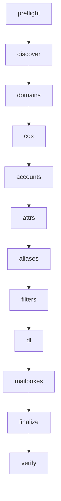

# Zimbra Tam Tenant Migrasyonu

[English](README.md) · [Türkçe](README.tr.md)

`zimbra_full_migrate.sh`, kaldığı yerden devam edebilen bir **Zimbra → Zimbra** tenant/mailbox orkestratörüdür.

Script **yeni / hedef** Zimbra sunucusunda `zimbra` kullanıcısı olarak çalışır. Kaynak sunucu **parolasız SSH** ile okunur. Mailbox verisi Zimbra REST API üzerinden TGZ olarak stream edilir; kaynak sunucuda büyük geçici mailbox arşivi oluşturulmaz.

Bu bir **mantıksal tenant migrasyonu**dur, sunucu klonu değildir.

> **Kullanım riski ve tüm operasyonel sorumluluk aracı kullanan kişiye/kuruma aittir.** Bu araç canlı Zimbra nesnelerini ve mailbox verisini değiştirir. Yedekleme, test migrasyonu, değişiklik onayı, kesinti, kapasite, güvenlik, hukuki/mevzuata uyum, geri dönüş ve taşınan her öğenin doğrulanmasından aracı çalıştıran kişi veya kurum tek başına sorumludur. Yazılım hiçbir garanti verilmeden sunulur; yürürlükteki hukukun izin verdiği azami ölçüde geliştirici ve katkıda bulunanlar veri kaybı, bozulma, kesinti, yanlış teslim, güvenlik olayı veya doğrudan/dolaylı zarardan sorumlu tutulamaz. AGPL garanti ve sorumluluk hükümleri için [LICENSE](LICENSE) dosyasına bakın.

```text
ESKİ Zimbra (kaynak)                        YENİ Zimbra (hedef)
┌─────────────────────────┐                 ┌──────────────────────────────┐
│ zmprov / zmmailbox      │  SSH + zmprov   │ zimbra_full_migrate.sh       │
│ LDAP nesneleri          │ ──────────────► │ 1. keşif / provision         │
│ mailbox'lar (store)     │  SSH + REST TGZ │ 2. zmmailbox ile import      │
└─────────────────────────┘                 │ 3. checkpoint + raporlar     │
                                            └──────────────────────────────┘
```

---

## İçindekiler

1. [Bu araç ne taşır](#bu-araç-ne-taşır)
2. [Bu araç neyi kopyalamaz](#bu-araç-neyi-kopyalamaz)
3. [Ne zaman kullanılmalı](#ne-zaman-kullanılmalı)
4. [Gereksinimler](#gereksinimler)
5. [Hızlı başlangıç](#hızlı-başlangıç)
6. [Cutover runbook](#cutover-runbook)
7. [Komut satırı referansı](#komut-satırı-referansı)
8. [Yapılandırma](#yapılandırma)
9. [Migrasyon fazları](#migrasyon-fazları)
10. [Checkpoint ve resume modeli](#checkpoint-ve-resume-modeli)
11. [Çalışma dizini](#çalışma-dizini)
12. [Mailbox aktarım ayrıntıları](#mailbox-aktarım-ayrıntıları)
13. [Öznitelik ve nesne politikası](#öznitelik-ve-nesne-politikası)
14. [Güvenlik](#güvenlik)
15. [Doğrulama ve raporlar](#doğrulama-ve-raporlar)
16. [İşletim ve sorun giderme](#işletim-ve-sorun-giderme)
17. [Sınırlamalar](#sınırlamalar)
18. [Geliştirici](#geliştirici)
19. [Lisans](#lisans)
20. [Operasyonel sahiplik](#operasyonel-sahiplik)

---

## Bu araç ne taşır

Script kaynak üzerindeki nesneleri keşfeder ve hedefte taşınabilir eşdeğerlerini yeniden oluşturur:

| Alan | Taşınan içerik |
| --- | --- |
| Domain'ler | Önce yerel domain'ler, sonra (hedef domain oluşunca) alias domain'ler |
| Domain ayarları | Taşınabilir küçük bir alt küme (`zimbraAuthMech`, GAL, public service host, logo URL'leri, mail durumu ve benzeri) |
| COS | COS adları ve taşınabilir `zimbra*` COS öznitelikleri |
| Hesaplar | Kullanıcı hesapları; display name / given name / surname |
| Parolalar | Mevcut `userPassword` hash'leri (kullanıcılar aynı parolayla giriş yapar) |
| COS ataması | Kaynak COS ID, hedefte COS adına çözülür |
| Hesap tercihleri | Seçili `zimbraPref*`, `zimbraFeature*`, kota, yönlendirme ve dizin alanları |
| Alias'lar | Hesap alias'ları (`zimbraMailAlias`) |
| Filtreler | Sieve script'leri (`zimbraMailSieveScript`) |
| Dağıtım listeleri | Listeler, taşınabilir DL öznitelikleri, DL alias'ları ve üyeler |
| Mailbox'lar | Posta, klasörler, kişiler, takvimler, görevler, etiketler ve REST metadata (TGZ) |

Varsayılan politika:

- Kaynak **yönetici** hesapları atlanır (`MIGRATE_ADMIN_ACCOUNTS=0`).
- Kaynak **sistem / kaynak** hesapları atlanır (`MIGRATE_SYSTEM_ACCOUNTS=0`). Buna `galsync.*`, `spam.*`, `ham.*` ve `virus-quarantine.*` gibi bilinen local-part'lar dahildir.

---

## Bu araç neyi kopyalamaz

Script bunu açıkça belirtir: **bit-bit sunucu klonu değildir**.

Şunları **kopyalamaz**:

- sunucu ID'leri, LDAP UUID'leri, mailbox ID'leri
- `/opt/zimbra/store` altındaki ham blob'lar
- MySQL / MariaDB dosyaları
- MTA kuyruğu
- TLS özel anahtarları
- lisanslar
- sunucu topolojisi
- `localconfig` sırları
- diğer host'a özel iç yapılar

Bu kimlikler hedef Zimbra kurulumu tarafından yeniden üretilir. Temiz bir hedef için bu bilinçli bir tercihtir.

Ayrıca tam kopya sayılmaz:

- identity, imza ve data-source ID'leri (bu ID'ler yasaklı özniteliklerdir)
- taşınamayan LDAP operasyonel öznitelikleri (`entryUUID`, `entryCSN`, create/modify timestamp ve benzeri)
- `zimbraMailHost` / `zimbraMailDeliveryAddress` (hedef yönlendirme yerel kalmalıdır)
- yönetici/sistem hesapları (açıkça açılmazsa)

---

## Ne zaman kullanılmalı

Bu orkestratörü şu durumlarda kullanın:

- her iki taraf da Zimbra
- yeni sunucudan eski sunucuya `zimbra` kullanıcısıyla SSH açılabiliyor
- **tenant düzeyinde** taşıma istiyorsunuz: domain, COS, hesap, DL, filtre ve mailbox içeriği
- **resume**, **kullanıcı bazlı tekrar** ve **delta cutover** geçişi gerekiyor

Şunların yerine **kullanmayın**:

- Zimbra resmi yedek / geri yükleme
- blok düzeyinde VM veya disk klonu
- aynı host üzerinde yerinde sürüm yükseltme
- orijinal sunucu kimliğinin afet kurtarması

Kaynak ve hedef sürümlerinin farklı olmasına izin verilir ama uyarı verilir. REST TGZ import çoğu zaman yine çalışır; canlı cutover öncesi temsilî mailbox'ları test edin.

---

## Gereksinimler

### Hedef (script'in çalıştığı yer)

- Çalışan bir Zimbra kurulumu
- Bash 4.2 veya üzeri
- Script'in `zimbra` kullanıcısıyla çalıştırılması
- Çalıştırılabilirler:
  - `/opt/zimbra/bin/zmprov`
  - `/opt/zimbra/bin/zmmailbox`
  - `/opt/zimbra/bin/zmcontrol`
- Sistem araçları: `ssh`, `awk`, `sed`, `grep`, `sort`, `sha256sum`, `gzip`, `flock`, `xargs`, `df`, `mktemp`, `openssl`, `stat`, `setsid`, `sleep`
- Yazılabilir migrasyon kökü (varsayılan: `./.zimbra-full-migration`)
- Boş disk:
  - staging dosya sistemi: en az `MIN_FREE_GB` (varsayılan **10 GiB**)
  - `/opt/zimbra/store` varsa: aynı rezerv

### Kaynak (eski Zimbra)

- `OLD_SSH_USER@OLD_HOST` üzerinden SSH ile erişilebilir (varsayılan kullanıcı: `zimbra`)
- **Parolasız / BatchMode** SSH (etkileşimli parola istemi yok)
- `/opt/zimbra/bin/zmprov` ve `/opt/zimbra/bin/zmmailbox` mevcut ve çalıştırılabilir
- Kaynak mailbox'lar `zmmailbox getRestURL` ile okunabilir

### SSH kurulumu (tipik)

Hedefte, `zimbra` olarak:

```bash
ssh-keygen -t ed25519 -N '' -f ~/.ssh/id_ed25519
ssh-copy-id zimbra@OLD_HOST
ssh -o BatchMode=yes zimbra@OLD_HOST 'printf OK'
```

Script şunları kullanır:

- `BatchMode=yes` (parola gerekecekse hemen başarısız olur)
- `ConnectTimeout=15`
- `ServerAliveInterval=30` / `ServerAliveCountMax=20`
- `Compression=no` (mailbox TGZ zaten sıkıştırılmıştır)

---

## Hızlı başlangıç

1. Script'i **hedef** Zimbra sunucusuna kopyalayın.
2. `zimbra` kullanıcısına geçin.
3. Kaynağa parolasız SSH'yi doğrulayın.
4. Yalnızca preflight çalıştırın:

```bash
OLD_HOST=192.168.1.10 ./zimbra_full_migrate.sh --preflight
```

5. Tam toplu (bulk) migrasyonu başlatın:

```bash
OLD_HOST=192.168.1.10 ./zimbra_full_migrate.sh
```

6. İlerlemeyi izleyin:

```bash
./zimbra_full_migrate.sh --status
```

7. Cutover anında eski sunucuyu dondurun ve delta geçişini çalıştırın (bkz. [Cutover runbook](#cutover-runbook)).

Script'i yeniden çalıştırmak tamamlanmış iş için güvenlidir: her faz checkpoint yazar ve bitmiş öğeleri atlar.

---

## Cutover runbook

İlk çalıştırma, kaynak hâlâ posta alabilirken yapılan **toplu** kopyadır. Bir mailbox export edildikten sonra gelen yeni iletiler o ilk TGZ'de yoktur.

### 1. Toplu geçiş (canlı kaynak)

```bash
OLD_HOST=192.168.1.10 ./zimbra_full_migrate.sh
```

Provision (domain, COS, hesap, alias, filtre, DL) checkpoint'lenir. Mailbox'lar varsayılan olarak `resolve=skip` ile import edilir; sonraki import mevcut öğelerin üzerine yazmaz.

### 2. Kaynağı dondurun

Son geçişten önce:

- kullanıcı erişimini durdurun (web, IMAP, ActiveSync, POP)
- eski sunucuya gelen SMTP'yi durdurun veya yönlendirin
- yoldaki postayı önemsiyorsanız eski MTA kuyruğunun boşalmasını bekleyin

### 3. Delta geçişi

```bash
./zimbra_full_migrate.sh --delta
```

`--delta` provision checkpoint'lerini silmez. Yaptıkları:

- her mailbox TGZ'sini yeniden export eder (önce önbellekteki arşivler silinir)
- mevcut `MAILBOX_RESOLVE` ile yeniden import eder (varsayılan `skip`)
- domain / hesap / alias / filtre / DL checkpoint'lerini olduğu gibi bırakır
- her kullanıcının deltası başlamadan eski mailbox checkpoint'ini kaldırır; kesilen veya başarısız delta açıkça eksik görünür

### 4. Doğrulayın ve DNS / MX'i çevirin

- `.zimbra-full-migration/reports/verification.csv` dosyasını inceleyin
- birkaç büyük veya VIP mailbox'ı elle karşılaştırın
- MX ve istemci uç noktalarını yeni sunucuya alın
- mümkünse kısa bir geri dönüş penceresi için eski sunucuyu salt-okunur tutun

---

## Komut satırı referansı

```text
./zimbra_full_migrate.sh
./zimbra_full_migrate.sh --delta
./zimbra_full_migrate.sh --phase PHASE
./zimbra_full_migrate.sh --user user@example.com
./zimbra_full_migrate.sh --status
./zimbra_full_migrate.sh --preflight
./zimbra_full_migrate.sh -h | --help
```

| Seçenek | Etkisi |
| --- | --- |
| *(yok)* | Tam hat: discover → domains → COS → accounts → attrs → aliases → filters → DL → mailboxes → finalize → verify |
| `--preflight` | Yalnızca SSH, ikili dosyalar, sürümler ve boş alan kontrolleri |
| `--status` | Checkpoint sayaçlarını yazdırır; preflight veya migrasyon **çalıştırmaz** |
| `--phase PHASE` | Tek bir fazı çalıştırır, sonra durumu yazdırır. `PHASE` zorunludur. |
| `--user ADDR` | Tek hesap için hedefli tekrar (accounts, attrs, aliases, filters, mailbox, finalize, verify). Hedef domain ve COS önceden var olmalıdır. `ADDR` zorunludur. |
| `--delta` | Tüm mailbox'ları yeniden export/import eder; provision checkpoint'leri kalır |
| `-h`, `--help` | Kullanım metni |

### Fazlar

| Faz | İşlev |
| --- | --- |
| `discover` | Domain, COS, hesap, DL envanteri; hesap LDAP dump; admin/sistem hesaplarını atla |
| `domains` | Yerel domain oluştur, taşınabilir domain özniteliklerini kopyala, sonra alias domain oluştur |
| `cos` | Eksik COS adlarını oluştur ve taşınabilir COS özniteliklerini kopyala |
| `accounts` | Hesap oluştur, parola hash'ini geri yükle, COS ata |
| `attrs` | Taşınabilir hesap öznitelikleri, tercihler, özellikler, yönlendirme |
| `aliases` | Eksik hesap alias'larını ekle |
| `filters` | Sieve script'lerini kopyala |
| `dl` | DL oluştur, öznitelik kopyala, DL alias ve üye ekle |
| `mailboxes` | Paralel TGZ export/import |
| `finalize` | Hesap durumlarını, ardından tüm değişiklikler bitince domain durumlarını geri yükle |
| `verify` | Kaynak ve hedef mailbox boyutlarıyla `verification.csv` yaz |

Örnekler:

```bash
OLD_HOST=192.168.1.10 ./zimbra_full_migrate.sh
MAILBOX_PARALLEL=6 ./zimbra_full_migrate.sh --phase mailboxes
./zimbra_full_migrate.sh --user user@example.com
./zimbra_full_migrate.sh --phase verify
./zimbra_full_migrate.sh --delta
./zimbra_full_migrate.sh --status
```

---

## Yapılandırma

Değerler şu sırayla gelebilir:

1. Gömülü varsayılanlar
2. Script yanındaki isteğe bağlı `CONFIG` dosyası (varsa source edilir)
3. Ortam değişkenleri
4. CLI bayrakları (`--delta`, `--phase`, `--user`)

Ortam değişkenleri hem `CONFIG` hem de script varsayılanlarının üzerine yazar. `CONFIG`, `BASEDIR` / `MIG_ROOT` kesinleşmeden önce okunur; kalıcı yol ezmeleri için doğru yerdir.

### İsteğe bağlı `CONFIG` dosyası

Script ile aynı dizine `CONFIG` adlı bir dosya koyun:

```bash
# Yalnızca örnek. Gerçek host veya sırları commit etmeyin.
OLD_HOST="192.168.1.10"
OLD_SSH_USER="zimbra"
MAILBOX_PARALLEL=4
MAILBOX_RESOLVE="skip"
KEEP_ARCHIVES=0
VERIFY_TGZ=1
MIN_FREE_GB=10
MIGRATE_ADMIN_ACCOUNTS=0
MIGRATE_SYSTEM_ACCOUNTS=0
# UI_VERBOSE=0
# NO_COLOR=1
# BASEDIR="/opt/zimbra-migration"
# MIG_ROOT="/opt/zimbra-migration/.zimbra-full-migration"
```

### Ortam değişkenleri ve varsayılanlar

| Değişken | Varsayılan | Anlamı |
| --- | --- | --- |
| `OLD_HOST` | *(zorunlu)* | Kaynak Zimbra host veya IP; `CONFIG` ya da ortam üzerinden verilmelidir |
| `OLD_SSH_USER` | `zimbra` | Kaynaktaki SSH kullanıcısı |
| `MAILBOX_PARALLEL` | `4` | Eşzamanlı mailbox export/import işçisi (pozitif tam sayı olmalı) |
| `MAILBOX_RESOLVE` | `skip` | TGZ import çakışma kipi: `skip`, `modify`, `reset` veya `replace` (`skip` resume / delta için en güvenlisidir) |
| `KEEP_ARCHIVES` | `0` | `1` import edilen TGZ'leri saklar; `0` başarıdan sonra siler |
| `VERIFY_TGZ` | `1` | Her indirilen arşivde import öncesi `gzip -t` |
| `MIN_FREE_GB` | `10` | Staging ve Zimbra store'da asgari boş alan (GiB) |
| `MIGRATE_ADMIN_ACCOUNTS` | `0` | `1` kaynak admin hesaplarını da taşır |
| `MIGRATE_SYSTEM_ACCOUNTS` | `0` | `1` sistem/kaynak ve üretilmiş sistem mailbox'larını da taşır |
| `BASEDIR` | script dizini | `MIG_ROOT` yoksa migrasyon kökünün temeli |
| `MIG_ROOT` | `$BASEDIR/.zimbra-full-migration` | Durum, dump, log, staging, raporlar |
| `UI_VERBOSE` | `0` | `1` her öğeyi de ekrana yazar (log her zaman tamdır) |
| `NO_COLOR` | yok | ANSI renkleri kapatır |

Başlangıçta `umask 077` ayarlanır. Yönetilen dizinler mevcut kullanıcıya ait olmalıdır; sembolik bağlantı dizinleri reddedilir ve dizin izinleri `0700` tutulur.

### Konsol çıktısı

Ekran sade tutulur: faz başlıkları, tek satırlık ilerleme, uyarılar ve hatalar. Nesne bazlı satırlar (`ACCOUNT CREATED`, `ATTRS OK`, mailbox `EXPORT`/`IMPORT`) `logs/migration.log` dosyasına gider; `UI_VERBOSE=1` değilse ekrana yazılmaz.

Mailbox işçileri ortak bir sayaç paylaşır (`ok / fail / skip`) ve yalnızca başarısız mailbox için kırmızı satır basar.

Renkler stdout bir TTY ise açılır. `NO_COLOR=1` kapatır.

---

## Migrasyon fazları



### `discover`

Kaynak envanterini LDAP kipinde `zmprov` ile okur:

- `gad` → domain'ler
- `gac` → COS
- `gaa` → tüm hesaplar
- `gadl` → dağıtım listeleri

Her hesap için `zmprov ga` çıktısı `dumps/accounts/<safe-name>.ldap` dosyasına yazılır ve sınıflandırılır:

| Atlama nedeni | Ne zaman |
| --- | --- |
| `READ_FAILED` | Kaynak `ga` başarısız |
| `ADMIN_ACCOUNT` | `zimbraIsAdminAccount` true ve admin migrasyonu kapalı |
| `SYSTEM_RESOURCE` | `zimbraIsSystemResource` true ve sistem migrasyonu kapalı |
| `SYSTEM_GENERATED` | local-part `galsync.*` / `spam.*` / `ham.*` / `virus-quarantine.*` ile eşleşir |

COS ID'leri sonraki `sac` için `discovery/cos-map.txt` içinde ada eşlenir.

Keşif, yenileme başlamadan önce `COMPLETE` işaretini geçersiz kılar. Yeni envanter yalnızca domain, COS, hesap, COS eşlemesi ve DL envanteri eksiksizse ve tüm hesap dump'ları okunabiliyorsa kabul edilir. Başarısız yenileme bayat veya kısmi veriyi tamamlanmış gösteremez; tam hat bağımlı fazlara geçmeden durur. Mevcut LDAP dump'ları yeniden kullanılır. Hesap özniteliklerini de yenilemek için yeniden keşiften önce ilgili `dumps/accounts/` dosyalarını kaldırın.

### `domains`

1. Her kaynak domain dump edilir ve `domain-map.txt` (`zimbraId` → ad) oluşturulur.
2. Önce **yerel** domain'ler oluşturulur (`zmprov cd`).
3. Taşınabilir domain öznitelikleri uygulanır.
4. Hedef domain oluştuktan sonra **alias** domain'ler oluşturulur (`zmprov cad`).

Hedefte zaten var olan domain'ler korunur; yalnızca öznitelikler uygulanır.

### `cos`

Eksik COS oluşturulur (`zmprov cc`), sonra taşınabilir `zimbra*` öznitelikleri kopyalanır. Mevcut COS nesneleri değiştirilmez, güncellenir.

### `accounts`

Her taşınabilir kullanıcı için:

1. Hesap yoksa rastgele geçici parolayla oluşturulur.
2. `userPassword` kaynak dump'tan geri yüklenir (hash; düz metin parola değil).
3. `zimbraCOSId`, `cos-map.txt` üzerinden çözülür ve `zmprov sac` çalışır.

Geçici parola yalnızca bootstrap sırrıdır. Hash başarıyla yazıldıktan sonra kullanıcılar orijinal parolalarıyla giriş yapar. Hash geri yükleme veya COS ataması başarısız olursa hesap **checkpoint'lenmez**.

### `attrs`

İzin listesindeki hesap öznitelikleri uygulanır; yönlendirme adresleri (`zimbraMailForwardingAddress`) ve çoğu `zimbraPref*` / `zimbraFeature*` anahtarı dahildir.

Çok değerli öznitelikler ilk değerde sıfırlanır, ek değerler `+attr` ile eklenir. Bu, tekrar çalıştırmayı idempotent yapar.

### `aliases`

Eksik `zimbraMailAlias` değerleri `zmprov aaa` ile eklenir. Zaten var olan alias'lar checkpoint'lenir ve atlanır.

### `filters`

Uzak Sieve script'i alınır, hash'lenir (`sha256`) ve yalnızca o kullanıcı+hash çifti yeni ise uygulanır. Boş script'ler atlanır.

### `dl`

Eksik listeler oluşturulur, taşınabilir DL öznitelikleri kopyalanır, DL alias'ları eklenir (`adla`), sonra eksik üyeler toplu eklenir (`zmprov -f` ile `adlm` satırları). Checkpoint'lenmiş DL'ler atlanır. Öznitelik, alias, üye okuma veya üye yazma hatası DL checkpoint'ini engeller; sonraki çalıştırma listeyi yeniden dener.

### `mailboxes`

Bkz. [Mailbox aktarım ayrıntıları](#mailbox-aktarım-ayrıntıları).

### `finalize`

Kaynak dump'tan önce `zimbraAccountStatus` (active, closed, locked vb.), ardından `zimbraDomainStatus` geri yüklenir. Askıya alınmış veya kapatılmış domain'ler hesap ve DL değişikliklerini reddedebileceği için domain durumu özellikle en sona bırakılır. Önceki fazlardan biri başarısızsa sonraki tekrar tenant'ı değiştirebilsin diye domain durumları ertelenir. Hedefli `--user` tekrarı yalnızca o hesabı sonlandırır; tüm domain'leri finalize etmez.

### `verify`

Kaynak ve hedef mailbox boyutlarını ve kaba bir durumu CSV olarak yazar.

---

## Checkpoint ve resume modeli

Durum `$MIG_ROOT/state/<faz>.ok` altındadır.

Her satır tamamlanmış bir anahtardır:

| Faz | Checkpoint anahtarı |
| --- | --- |
| `discover` | `COMPLETE` |
| `domains` | domain adı |
| `cos` | COS adı |
| `accounts` | hesap adresi |
| `attrs` | hesap adresi |
| `aliases` | `kullanıcı\|alias` |
| `filters` | `kullanıcı\|sha256` |
| `dl` | DL adresi (yalnızca başarılı üye geçişinden sonra) |
| `mailboxes` | hesap adresi |
| `finalize` | hesap adresi |
| `domain_status` | domain adı |

Yazmalar `flock` ile korunur; paralel mailbox işçileri aynı dosyayı güvenle güncelleyebilir.

Resume kuralları:

- Tam script yeniden çalışır: tamamlanmış anahtarlar atlanır.
- `--phase mailboxes` kalan mailbox'lara devam eder.
- `--user user@example.com` hesapla ilgili fazları yine çalıştırır ama o adrese filtreler.
- `--delta` herkesi yeniden export eder ve her kullanıcının eski mailbox checkpoint'ini o kullanıcının deltası başlamadan kaldırır. Başarısız veya kesilen kullanıcı eksik kalır; provision checkpoint'leri korunur.

Delta olmayan bir çalıştırmada tek bir başarısız mailbox'ı tekrar denemek için satırını `state/mailboxes.ok` dosyasından silin ve `--phase mailboxes` veya `--user` çalıştırın.

---

## Çalışma dizini

Script ihtiyaç duyduğu dizin ağacını kendisi oluşturur. Varsayılan kök: `<script-dizini>/.zimbra-full-migration`.

Bu konum oluşturulamaz veya yazılamazsa (örneğin script salt-okunur bir yerdeyse) sırayla şunlara düşer:

1. `~/.zimbra-full-migration`
2. `/opt/zimbra/.zimbra-full-migration`
3. `/tmp/zimbra-full-migration-<uid>`

Açıkça verilen `MIG_ROOT` başka yere taşınmaz; yazılamazsa script çıkar.

```text
.zimbra-full-migration/
├── discovery/
│   ├── domains.txt
│   ├── cos.txt
│   ├── cos-map.txt                 # zimbraId|COS-adı
│   ├── domain-map.txt              # zimbraId|domain-adı
│   ├── accounts-all.txt
│   ├── accounts.txt                # taşınabilir kullanıcılar
│   ├── accounts-skipped.txt        # kullanıcı|NEDEN
│   └── dls.txt
├── dumps/
│   ├── accounts/<kullanıcı>.ldap
│   ├── domain.<domain>.ldap
│   ├── cos.<cos>.ldap
│   ├── dl.<dl>.ldap
│   └── filter.<kullanıcı>.sieve
├── stage/                          # aktarım sırasındaki TGZ arşivleri
├── state/                          # <faz>.ok checkpoint dosyaları
├── locks/                          # faz başına flock dosyaları
├── tmp/run.XXXXXX/                 # çalıştırmaya özel alan; çıkışta silinir
├── logs/
│   ├── migration.log
│   └── mailboxes/<kullanıcı>.log
└── reports/
    ├── mailbox-sizes.raw
    ├── failures.txt                # bu çalıştırma için faz|nesne|neden
    └── verification.csv
```

Hesap ve nesne adları `safe_name` ile kodlanır (`%`, `/`, `:` ve boşluk yüzde biçimli kaçışlar kullanır); böylece farklı kaynak adları aynı dosya adına dönüşmez.

---

## Mailbox aktarım ayrıntıları

Her işçi:

1. Kullanıcı zaten checkpoint'liyse atlar (`--delta` değilse).
2. Delta kipinde eski mailbox checkpoint'ini geçersiz kılar ve önbellekteki TGZ verisini siler.
3. Hedef hesabın var olduğunu doğrular.
4. Staging boş alanını kontrol eder.
5. **Kaynakta** SSH ile export eder:

   ```text
   zmmailbox -z -m USER -t 0 getRestURL '//?fmt=tgz&meta=1&query=is:anywhere'
   ```

   Akış `stage/<kullanıcı>.tgz.part` dosyasına yazılır, sonra `.tgz` olarak yeniden adlandırılır.
6. Hem yeni indirilmiş hem de önbellekteki dosyayı isteğe bağlı olarak `gzip -t` ile doğrular.
7. **Hedefte** import eder:

   ```text
   zmmailbox -z -m USER -t 0 postRestURL '//?fmt=tgz&resolve=SKIP' archive.tgz
   ```
8. Kaynak ve hedef mailbox boyutlarını kaydeder.
9. `KEEP_ARCHIVES=1` değilse arşivi siler. **Başarısız** import arşivi tekrar deneme için saklar.

`query=is:anywhere` ve `meta=1`, klasörler arası posta ile REST metadata (klasör, kişi, takvim, görev, etiket) çekmek içindir.

İşçiler ayrı bir süreç grubunda `xargs -P "$MAILBOX_PARALLEL"` ile çalışır. `MAILBOX_PARALLEL` değerini yalnızca kaynak, hedef ve ağ kaldırabiliyorsa yükseltin. Her işçi import bitene kadar hedefte tam bir mailbox arşivi tutar.

`Ctrl+C`, orkestratörü ve etkin mailbox süreç grubunun tamamını (SSH ve `zmmailbox` alt süreçleri dâhil) durdurur; kod `130` ile çıkar. Yarım iş için checkpoint yazılmaz, kalan `.part` dosyası sonraki denemede atılır.

İşçi konsol durumları:

| Durum | Anlamı |
| --- | --- |
| `EXPORT` | Kaynaktan TGZ stream ediliyor |
| `VERIFY` | `gzip -t` devam ediyor |
| `CACHED` | Mevcut yerel TGZ yeniden kullanılıyor (delta değil) |
| `IMPORT` | `postRestURL` devam ediyor |
| `OK` | Import edildi ve checkpoint yazıldı |
| `SKIP` | Zaten `state/mailboxes.ok` içinde |
| `NOUSER` | Hedef hesap yok |
| `NOSPACE` | Staging `MIN_FREE_GB` altında |
| `CORRUPT` | TGZ `gzip -t` doğrulamasını geçemedi |
| `FAILED` | Export, boş dosya veya import hatası |

---

## Öznitelik ve nesne politikası

### Asla kopyalanmaz (yasaklı)

Bu öznitelikler her nesne türünde atılır:

`zimbraId`, `zimbraCreateTimestamp`, `zimbraLastLogonTimestamp`, `zimbraMailHost`, `zimbraMailDeliveryAddress`, `zimbraMailAlias`, `zimbraMailSieveScript`, `zimbraCOSId`, `zimbraDomainId`, `zimbraServerId`, `zimbraAuthTokenValidityValue`, `zimbraPrefIdentityId`, `zimbraSignatureId`, `zimbraDataSourceId`, `objectClass`, `entryCSN`, `entryUUID`, `creatorsName`, `modifiersName`, `createTimestamp`, `modifyTimestamp`

Alias, Sieve ve COS, genel öznitelik kopyalayıcı yerine kendi fazlarında işlenir.

### Hesap izin listesi

Dizin: `cn`, `displayName`, `givenName`, `sn`, `description`, `title`, `telephoneNumber`, `mobile`, `company`, `street`, `l`, `st`, `postalCode`, `co`, `initials`, `middleName`

Posta / politika: `zimbraMailStatus`, `zimbraMailQuota`, `zimbraMailCanonicalAddress`, `zimbraMailForwardingAddress`, `zimbraPasswordMustChange`, `zimbraPasswordLocked`

Artı tüm `zimbraPref*` ve `zimbraFeature*`.

### COS

Yasaklı olmayan her `zimbra*` özniteliği.

### Domain izin listesi

`zimbraAuthMech`, `zimbraMailStatus`, `zimbraGalMode`, `zimbraGalMaxResults`, `zimbraPrefTimeZoneId`, `zimbraVirtualHostname`, `zimbraPublicServiceHostname`, `zimbraPublicServiceProtocol`, `zimbraPublicServicePort`, `zimbraSkinLogoURL`, `zimbraSkinLogoLoginBanner`, `zimbraDomainMandatoryMailSignatureEnabled`

`zimbraDomainStatus`, hesap, alias, DL, mailbox ve hesap durumu işleri tamamlandıktan sonra `finalize` tarafından ayrıca uygulanır.

### Dağıtım listesi izin listesi

`displayName`, `description`, `zimbraHideInGal`, `zimbraMailStatus`, abonelik / abonelikten çıkma politikası ve paylaşım mesajı ayarları.

Bir öznitelik yazılamazsa script hatayı kaydeder ama nesnenin kalan özniteliklerini denemeye devam eder. Nesne checkpoint'lenmez ve çalışma sıfırdan farklı kodla çıkar; sonraki çalıştırma nesneyi yeniden dener.

---

## Güvenlik

- Yalnızca `zimbra` olarak çalıştırın. Script diğer kullanıcıları reddeder.
- Oluşturulan tüm dosyalarda `umask 077` (LDAP dump'larında parola hash'leri vardır).
- Yönetilen migrasyon dizinleri mevcut kullanıcıya ait gerçek dizinler olmalıdır; sembolik bağlantılar reddedilir ve izinler `0700` yapılır.
- Parola hash'leri `zmprov ma ... userPassword` ile uygulanır; script bunları yazdırmaz ve `migration.log` dosyasına eklemez. Süreç listesinde veya hedefin `zmprov` loglarında yine görünebilir — `dumps/` dizinini **gizli** sayın.
- Başarısız parola-hash geri yüklemesi hesabı checkpoint'lemez; sonraki çalıştırma hash'i yeniden dener.
- Aynı anda yalnızca bir migrasyon süreci çalışabilir (`locks/migrate.lock`). `--status` bu kilidi almaz.
- Her gerçek çalıştırmanın kendine ait `tmp/run.XXXXXX` alanı vardır. `--status` veya kilidi alamayan ikinci süreç, etkin çalıştırmanın geçici dosyalarını silmez.
- `Ctrl+C` paralel işçileri ve alt süreçlerini sonlandırır, kod `130` ile çıkar.
- Geçici hesap parolaları `openssl rand -hex 24` ile üretilir.
- Admin hesapları varsayılan olarak atlanır; hedefin `admin@...` hesabının üzerine yazılmaz.
- Hedefte zaten var olan domain / hesap / COS / DL yok edilmez, yeniden kullanılır.
- Mailbox import varsayılanı `resolve=skip`; daha önce import edilmiş öğelerin üzerine yazılmaz.
- Mailbox işinden önce staging ve store dosya sistemleri kontrol edilir.
- SSH etkileşimsizdir (`BatchMode`); argümanlar `printf %q` ile kaçırılır.
- Başarısız mailbox import'ları TGZ'yi inceleme için saklar; başarılı olanlar disk tasarrufu için varsayılan olarak silinir.

`$MIG_ROOT` dizinini koruyun. Canlı parola hash'leri, Sieve script'leri ve mailbox arşivleri içerir.

---

## Doğrulama ve raporlar

### Durum ekranı

`./zimbra_full_migrate.sh --status` keşif sayılarını ve faz başına kaydedilmiş anahtar sayısını yazdırır.

### `reports/verification.csv`

```text
account,source_mailbox_bytes,destination_mailbox_bytes,status
```

| Durum | Anlamı |
| --- | --- |
| `IMPORTED` | Mailbox checkpoint'i var |
| `CHECK` | Hesap var ama mailbox checkpoint'lenmemiş |
| `DEST_ACCOUNT_MISSING` | Kullanıcı hedefte yok |
| `WARNING_DEST_EMPTY` | Kaynak boyut &gt; 0 ve hedef boyut 0 |
| `SOURCE_SIZE_UNAVAILABLE` | Kaynak boyut sorgusu başarısız |
| `DEST_SIZE_UNAVAILABLE` | Hedef boyut sorgusu başarısız |
| `SOURCE_AND_DEST_SIZE_UNAVAILABLE` | İki boyut sorgusu da başarısız |

Boyutlar her iki tarafta `zmmailbox gms` ile alınır. Bu bir **sağlık kontrolü**dür, bit-bit içerik kanıtı değildir. Klasör düzeni, takvim metadata'sı ve atlanan çakışmalar başarılı import sonrası bile boyutları farklı gösterebilir.

### `reports/mailbox-sizes.raw`

Yalnızca eklenen satırlar: `kullanıcı|kaynak_byte|hedef_byte|zaman`.

### `reports/failures.txt`

Bu çalıştırmadaki her başarısız öğe için bir satır (`faz|nesne|neden`). Dosya her gerçek migrasyonun başında sıfırlanır (`--status` / `--preflight` değil). Dosya doluysa süreç **1** ile çıkar.

### Loglar

- `$MIG_ROOT/logs/migration.log` — orkestratör logu
- `$MIG_ROOT/logs/mailboxes/<kullanıcı>.log` — mailbox başına export/import

### Çıkış kodları

| Kod | Anlamı |
| --- | --- |
| `0` | İstenen iş bitti ve `failures.txt` boş |
| `1` | Preflight başarısız, bir faz başarısız veya `failures.txt` içinde en az bir öğe var |
| `2` | Bilinmeyen seçenek veya eksik `--phase` / `--user` değeri |

---

## İşletim ve sorun giderme

### Keşif ilk hesaptan sonra bitiyor

Eski kopyalar SSH'yi `-n` olmadan çağırıyordu. SSH kalan hesap/domain listesini stdin olarak yutuyordu; keşif `1/N` ile bitiyor, sonraki fazlarda `awk: fatal: cannot open file ...domain.*.ldap` görülüyordu.

Script'i güncelleyip yeniden çalıştırın. Yarım keşif (`accounts + skipped < accounts-all`) tespit edilir ve keşif tekrarlanır. Dump'ı olmayan domain checkpoint'leri yeniden denenir.

### Preflight SSH'de düşer

`Passwordless SSH to zimbra@HOST failed.`

Önce BatchMode SSH'yi düzeltin. Script parola sormaz.

### Sürüm uyarısı

Farklı `zmcontrol -v` dizeleri uyarıdır, sert duruş değildir. Cutover'a kilitlenmeden önce birkaç mailbox doğrulayın (küçük, büyük, takvim yoğun, filtre yoğun).

### Mailbox sırasında disk dolu

Staging `MIN_FREE_GB` altındayken işçiler export başlatmaz. Paralelliği düşürün, `KEEP_ARCHIVES=0` kullanın ve yeniden deneyin. Başarısız arşivler `stage/` altında kalır; siz silene veya sonraki başarılı import kaldırana kadar.

### Tek hesap başarısız

```bash
./zimbra_full_migrate.sh --user user@example.com
```

Veya adresi `state/mailboxes.ok` dosyasından silip `--phase mailboxes` çalıştırın.

### Taze keşif gerekiyor

Silin veya taşıyın:

- `discovery/accounts.txt`
- `discovery/domains.txt`

Kaynak LDAP değiştiyse `dumps/accounts/*.ldap` dosyalarını da.

### Alias zaten kullanımda

`aaa` / `adla` hataları kaydedilir ve çalışmayı sıfırdan farklı kodla bitirir. Adres hedefte başka bir hesaba veya DL'ye ait olabilir. Başarısız nesne checkpoint'lenmez ve daha sonra yeniden denenir.

### Filtre geri yükleme başarısız

Sieve tek bir `zmprov ma` argümanı olarak geçilir. Çok büyük veya uyumsuz script'ler başarısız olabilir; ham script `dumps/filter.<kullanıcı>.sieve` dosyasında kalır.

### Paralellik çok yüksek

Belirtiler: kaynak `mailboxd` zaman aşımları, SSH kopmaları, hedef store I/O doygunluğu. `MAILBOX_PARALLEL` değerini `2` veya `1` yapın.

### Delta sonrası hâlâ yeni posta yok

`--delta` yalnızca kaynak dondurulduktan sonra işe yarar. Delta sırasında kullanıcılar hâlâ eski hosta teslim ediyorsa başka bir dondurma + delta gerekir.

---

## Sınırlamalar

- Tek host SSH modeli: bir kaynak hostname, bir hedef (script'in çalıştığı host).
- Küme bilinçli topoloji migratörü değildir (çoklu mailbox sunucusu arasında otomatik store yerleşimi yok).
- Tam LDAP / store / MySQL klonu değildir.
- Identity, imza ve dış data source'lar ID'lerinden yeniden kurulmaz.
- Admin ve sistem hesapları açıkça açılmazsa hariçtir; açmak hedefin kendi admin'i ile çakışabilir.
- Mailbox eşitliği yaklaşıktır (boyut + import başarısı); öğe öğe karşılaştırma yoktur.
- `--delta` + `resolve=skip` hedefte olmayan öğeleri ekler; toplu geçişten sonra kaynakta silinen öğeleri hedefte silmez.
- `--delta` yalnızca mailbox içeriği deltasıdır, provision deltası değildir. Checkpoint sonrasında kaynakta değişen parola, öznitelik, alias, filtre, COS ve DL değerleri otomatik yeniden uygulanmaz; bu değişiklikler gerekiyorsa ilgili checkpoint/dump'ları kaldırıp fazları yeniden çalıştırın.
- `MAILBOX_RESOLVE` değiştirilebilir ama `skip` dışındaki kipler daha önce import edilmiş postanın üzerine yazabilir. Değiştirmeden önce Zimbra `postRestURL` resolve kiplerini anlayın.
- Export maliyeti eski sunucudadır (CPU, mailboxd, ağ). Eski sunucudan TGZ saklaması istenmez ama yine de **üretilir**.
- Hedef, eşzamanlı her işçi için en az bir tam mailbox arşivi tutmalıdır.

---

## Geliştirici

[Cuma Kurt](https://www.linkedin.com/in/cuma-kurt-34414917/) tarafından geliştirilmekte ve sürdürülmektedir.

Kaynak depo: [github.com/cumakurt/zimbra_full_migrate](https://github.com/cumakurt/zimbra_full_migrate)

## Lisans

Telif hakkı © 2026 Cuma Kurt.

Bu proje yalnızca **GNU Affero General Public License v3.0** (`AGPL-3.0-only`) ile lisanslanmıştır. Ayrıntılar için [LICENSE](LICENSE) dosyasına bakın. “Only” tanımı, bu iznin sonraki AGPL sürümlerine otomatik olarak genişlemediği anlamına gelir.

## Operasyonel sahiplik

Aracın kullanılıp kullanılmayacağına, ne zaman, nerede ve nasıl çalıştırılacağına ilişkin kararların ve bu kullanımın tüm sonuçlarının sorumluluğu operatöre aittir. Operatör production kullanımından önce uyumluluğu bağımsız olarak değerlendirmeli, doğrulanmış yedekleri korumalı, temsilî verilerle test yapmalı, değişiklik planını onaylamalı, çalışmayı izlemeli, sonucu doğrulamalı ve uygulanabilir bir geri dönüş yolu tutmalıdır. Başarılı çıkış kodu veya `verification.csv`, kullanıcı kabul testinin yerine geçmez.

Bu depo şu an yalnızca orkestratör script'ini içerir. Bunu bir işletim aracı olarak kullanın: önce bir kopyada veya küçük bir domain'de test edin, `$MIG_ROOT` dizinini paylaşılan / herkese açık disklerde tutmayın ve doğrulama kabul edilene kadar geri dönüş planı (eski sunucu kapalı ama sağlam) bulundurun. [LICENSE](LICENSE) içindeki garanti reddi ve sorumluluk sınırlaması hükümleri geçerlidir.

Depo kontrolleri `./tests/test.sh` ile çalıştırılabilir. Test paketi Bash, ShellCheck ve Python 3 gerektirir; CLI doğrulamasını, yapılandırma önceliğini, geçici çalışma alanı yalıtımını, sahte Zimbra/SSH komutlarıyla tam hattı ve anında `Ctrl+C` sonlandırmasını kapsar.
